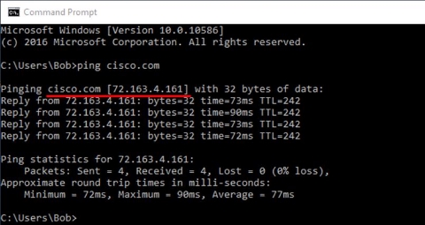

C8280

**Departamento Académico de Ingeniería -Comunicación de Datos y Redes** 

**Actividad 10 : Aprendiendo DNS**

**Objetivos**

- Observar la conversión de una URL en una dirección IP.
- Observar la búsqueda del DNS utilizando el comando nslookup.

**Aspectos básicos/situación**

El sistema de nombres de dominio (DNS) se invoca cuando se escribe un localizador uniforme de recursos (URL), como [http://www.cisco.com](http://www.cisco.com/), en un navegador web. La primera parte de la dirección URL describe el protocolo que se está utilizando. Los protocolos comunes son HTTP (protocolo de transferencia de hipertexto), HTTPS (protocolo de transferencia de hipertexto por capa de sockets seguros) y FTP (protocolo de transferencia de archivos).

El DNS usa la segunda parte de la URL, que en este ejemplo es [www.cisco.com.](http://www.cisco.com/) DNS traduce el nombre de dominio (como www.cisco.com) a una dirección IP para permitir que el host de origen llegue al host de destino.

Trabaja con un compañero de tu grupo asignado para completar esta práctica.

**Recursos necesarios**

- 1 PC (Windows 10) con conectividad a Internet

Paso 1: **Observa la conversión DNS.**

1. Haz clic con el botón secundario del mouse en **Inicio** y seleccione **Línea de comandos**.
1. En la línea de comandos, escriba **ping cisco.com** y presione **Enter**. La computadora necesita traducir cisco.com a una dirección IP para que sepa a dónde enviar los paquetes del protocolo de mensajes de control de Internet (ICMP). Un ping es un tipo de paquete ICMP.
3. La primera línea del resultado muestra que DNS convirtió cisco.com en una dirección IP. Se supone que debe poder ver el efecto del DNS aun cuando haya un firewall instalado que impida la realización de pings o aun cuando Cisco haya impedido que los usuarios hagan ping en su servidor Web.

¿Qué dirección IP aparece en la pantalla?

Me aparece 2001:420:1101:1::185

¿Es la misma que aparece en la imagen?

No, no es la misma. Ademas de cambiar el IP, tambien cambia la version de este, mientras que yo tengo la version IPv6, la de la imagen es IPv4

¿Cisco.com siempre debe resolver la misma dirección IP? Explica

No, cisco no siempre deve devolver la misma dirección IP. Esto se debe a que cada servidor tiene su propia IP, y cisco tiene diferentes servidores distribuidos geograficamente o servidores con una función especifica, es por ello que cuando hacemos ping, los servidores cambian, probablemente aparezca la IP del servidor más cercano geograficamente.

4. Trabaja con otro estudiante y comente una o dos otras aplicaciones (además del comando **ping**) en el que la computadora necesitaría usar DNS para traducir un nombre de dominio a una dirección IP.

Paso 2: **Verifica el funcionamiento de DNS con el comando nslookup.**

1. En la línea de comandos, escribe **nslookup** y presione Enter.

   

   La imagen de arriba muestra que el servidor DNS predeterminado se configuró para usar un servidor DNS de Google. ¿Cómo figura su servidor predeterminado?

2. Después de emitir el comando **nslookup** anterior, observa cómo la línea de comandos cambió a un solo **>**. Esta es la línea del programa **nslookup**. Desde aquí, puede introducir comandos relacionados con el DNS.

   En la petición de entrada, escriba **?** para ver una lista de todos los comandos disponibles que puede usar en el modo **nslookup**.

   Menciona los tres comandos que puede usar con **nslookup**:

3. En la línea de comandos de **nslookup**, escriba **cisco.com**. En los espacios en blanco completa tus respuestas.

   ¿Cuál es la dirección IP traducida?

   ¿La dirección IP es una dirección IPv4 o una dirección IPv6?

   ¿Es la misma que la dirección IP que se muestra con el comando ping?

   En el símbolo del sistema, escribe la dirección IP del servidor Web de Cisco que acabas de encontrar. ¿Cuál es el resultado del nombre?

Paso 3: **Identifica servidores de correo utilizando el comando nslookup**

1. Para identificar los servidores de correo con **nslookup**, escriba **set type=mx**.
1. En la línea de comandos, escriba **cisco.com**.

¿Cuáles son los nombres de los servidores de correo de Cisco identificados en el campo **mail exchanger**?

3. En la línea de comandos, escribe **exit** para volver a la línea de comandos normal.
3. En la petición de entrada de comandos escriba **ipconfig /all**.
3. Escribe las direcciones IP de todos los servidores DNS que usa la computadora de la institución educativa.
3. Escribe **exit** y presione **Enter** para cerrar la ventana de la línea de comandos.

**Preguntas**

1. Si la universidad no tuviera un servidor DNS, ¿qué efectos tendría esto en el uso de Internet?
1. Algunas empresas no dedican un solo servidor para el DNS. Por el contrario, el servidor DNS también proporciona otras funciones. ¿Qué funciones crees que se pueden incluir en un servidor DNS? Usa el comando **ipconfig /all** para ayudarte con esto.
Comunicación de Datos y Redes
