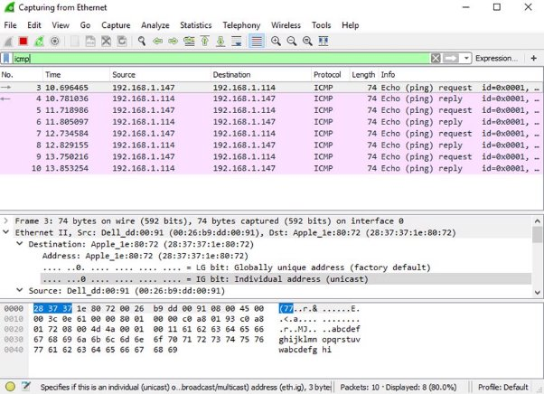

**Departamento Académico de Ingeniería C8280 -Comunicación de Datos y Redes** 

**Actividad 9: Uso de Wireshark para ver el tráfico de la topología de red**

**Objetivos**

**Parte 1: Capturar y analizar datos ICMP locales en Wireshark Parte 2: Capturar y analizar datos ICMP remotos en Wireshark**

**Información básica/situación**

Wireshark es un analizador de protocolos de software o una aplicación “husmeador de paquetes” que se utiliza para la solución de problemas de red, análisis, desarrollo de protocolo y software y educación. Mientras el flujo de datos va y viene en la red, el husmeador “captura” cada unidad de datos del protocolo (PDU) y puede decodificar y analizar su contenido de acuerdo a la RFC correcta u otras especificaciones.

Es una herramienta útil para cualquiera que trabaje con redes y se puede utilizar en la mayoría de las prácticas de laboratorio en los cursos de CCNA para el análisis de datos y la solución de problemas. En esta práctica de laboratorio, usará Wireshark para capturar direcciones IP del paquete de datos ICMP y direcciones MAC de la trama de Ethernet.

**Recursos necesarios**

- 1 PC (Windows con acceso a internet)
- Se utilizarán PC adicionales en una red de área local (LAN) para responder a las solicitudes de ping.

**Instrucciones**

1. **Captura y análisis de datos ICMP locales en Wireshark**

   En la parte 1 de esta práctica de laboratorio, harás ping a otra PC en la LAN y capturará solicitudes y respuestas ICMP en Wireshark. También verá dentro de las tramas capturadas para obtener información específica. Este análisis debe ayudar a aclarar de qué manera se utilizan los encabezados de paquetes para transmitir datos al destino.

**Recupera las direcciones de interfaz de la PC**

Para esta práctica de laboratorio, deberás recuperar la dirección IP de la PC y la dirección física de la tarjeta de interfaz de red (NIC), que también se conoce como “dirección MAC”.

1. En una ventana del símbolo del sistema, ingresa **ipconfig /all**, a la dirección IP de la interfaz de su PC, su descripción y su dirección MAC (física).

   C:\Users\Student> **ipconfig /all** Configuración IP de Windows

Host Name . . . . . . . . . . . . : DESKTOP-NB48BTC Primary Dns Suffix . . . . . . . :

Node Type . . . . . . . . . . . . : Hybrid

IP Routing Enabled. . . . . . . . : No

WINS Proxy Enabled. . . . . . . . : No

Ethernet adaptador Ethernet:

Connection-specific DNS Suffix . :

Description . . . . . . . . . . . : Intel(R) 82577LM Gigabit Network Connection

Physical Address. . . . . . . . . :00-26-B9-DD-00-91 DHCP Enabled. . . . . . . . . . . : No

Autoconfiguration Enabled . . . . : Yes

Link-local IPv6 Address . . . . .: fe80: :d809:d 939:110 f:1b7f%20 (Preferido)

IPv4 Address. . . . . . . . . . . : 192.168.1.147 (Preferido)

Subnet Mask . . . . . . . . . . . : 255.255.255.0

Default Gateway . . . . . . . . . : 192.168.1.1

<output omitted>

2. Solicita a un miembro o a los miembros del equipo la dirección IP de su PC y proporcióneles la suya. En esta instancia, no proporcione su dirección MAC.

**Inicia Wireshark y comienza a capturar datos**

1. Navega a Wireshark. Haz doble clic en la interfaz deseada para iniciar la captura de paquetes. Asegúrate de que la interfaz deseada tenga tráfico.
1. La información comienza a desplazar hacia abajo la sección superior de Wireshark. Las líneas de datos aparecen en diferentes colores según el protocolo.

   Es posible desplazarse muy rápidamente por esta información según la comunicación que tiene lugar entre la PC y la LAN. Se puede aplicar un filtro para facilitar la vista y el trabajo con los datos que captura Wireshark.

   Para esta práctica de laboratorio, solo nos interesa mostrar las PDU de ICMP (ping). Escriba **icmp** en el cuadro **Filter** en la parte superior de Wireshark y presione **Enter,** o haga clic en el botón **Apply** (signo de flecha) para ver sólo las PDU ICMP (ping).

3. Este filtro hace que desaparezcan todos los datos de la ventana superior, pero se sigue capturando el tráfico en la interfaz. Navega a la ventana del símbolo del sistema y haz ping a la dirección IP que recibió de un miembro de su equipo.

   C:\ > **ping 192.168.1.114**

   Pinging 192.168.1.114 with 32 bytes of data:

   Reply from 192.168.1.114: bytes=32 time<1ms TTL=128 Reply from 192.168.1.114: bytes=32 time<1ms TTL=128 Reply from 192.168.1.114: bytes=32 time<1ms TTL=128 Reply from 192.168.1.114: bytes=32 time<1ms TTL=128

   Ping statistics for 192.168.1.114:

   Packets: Sent = 4, Received = 4, Lost = 0 (0% loss), Approximate round trip times in milli-seconds:

Minimum = 0ms, Maximum = 0ms, Average = 0ms

Comenzará a ver que aparecen datos en la ventana superior de Wireshark nuevamente.

**Nota**: Si la PC del miembro de tu equipo no responde a sus pings, es posible que el firewall de la PC del miembro del equipo bloquee estas solicitudes. Usa la siguiente información Allowing ICMP Traffic Through a Firewall para obtener información sobre cómo permitir el tráfico ICMP a través del firewall con Windows.

4. Detenga la captura de datos haciendo clic en el ícono **Stop Capture** (Detener captura).

**Examina los datos capturados**

Examinamos los datos que se generaron mediante las solicitudes de ping de la PC del miembro del equipo. Los datos de Wireshark se muestran en tres secciones: 1) la sección superior muestra la lista de tramas de PDU capturadas con un resumen de la información de paquetes IP enumerada, 2) la sección media indica información de la PDU para la trama seleccionada en la parte superior de la pantalla y separa una trama de PDU capturada por las capas de protocolo, y 3) la sección inferior muestra los datos sin procesar de cada capa. Los datos sin procesar se muestran en formatos hexadecimal y decimal.

5. Haga clic en las primeras tramas de PDU de la solicitud de ICMP en la sección superior de Wireshark. Observe que la columna **Source** contiene la dirección IP de su PC y la columna **Destination** contiene la dirección IP de la PC del compañero de equipo a la que hizo ping.
5. Con esta trama de PDU aún seleccionada en la sección superior, navegue hasta la sección media. Haga clic en el signo más que está a la izquierda de la fila de Ethernet II para ver las direcciones MAC de origen y destino.

   ¿La dirección MAC de origen coincide con la interfaz de su PC?

   ¿La dirección MAC de destino en Wireshark coincide con la dirección MAC del compañero de equipo?

   ¿De qué manera su PC obtiene la dirección MAC de la PC a la que hizo ping?

   **Nota**: En el ejemplo anterior de una solicitud de ICMP capturada, los datos ICMP se encapsulan dentro de una PDU del paquete IPv4 (encabezado de IPv4), que luego se encapsula en una PDU de trama de Ethernet II (encabezado de Ethernet II) para la transmisión en la LAN.

2. **Captura y analiza datos ICMP remotos en Wireshark**

   En la parte 2, harás ping a los hosts remotos (hosts que no están en la LAN) y examinará los datos generados a partir de esos pings. Luego, determinará las diferencias entre estos datos y los datos examinados en la parte 1.

**Comienza a capturar datos en la interfaz**

7. Vuelva a iniciar la captura de datos.
7. Se abre una ventana que le solicita guardar los datos capturados anteriormente antes de comenzar otra captura. No es necesario guardar esos datos. Haga clic en **Continue without Saving**
7. Con la captura activa, haga ping a las siguientes tres URL de sitios web desde un símbolo del sistema de Windows:
1) www.yahoo.com
1) www.cisco.com
1) www.google.com

**Nota**: Cuando haga ping a las URL enumeradas, observa que el Servidor de nombres de dominio (DNS) traduce la URL a una dirección IP. Observa la dirección IP recibida para cada URL.

d . Puedes detener la captura de datos haciendo clic en el ícono **Stop Capture**. **Inspecciona y analiza los datos de los hosts remotos**

Revise los datos capturados en Wireshark y examine las direcciones IP y MAC de las tres ubicaciones a las que hizo ping. Indique las direcciones IP y MAC de destino para las tres ubicaciones en el espacio proporcionado.

Dirección IP de **www.yahoo.com**: Dirección MAC para **www.yahoo.com**: Dirección IP para **www.cisco.com**: Dirección MAC para **www.cisco.com**: Dirección IP de **www.google.com**:

Dirección MAC para **www.google.com**:

¿Qué es importante sobre esta información?

¿En qué se diferencia esta información de la información de ping local que recibió en la parte

**Pregunta**

¿Por qué Wireshark muestra la dirección MAC vigente de los hosts locales, pero no la dirección MAC vigente de los hosts remotos?

**Apéndice A: Permitir el tráfico ICMP a través de un firewall**

Si los miembros del equipo no pueden hacer ping a su PC, es posible que el firewall esté bloqueando esas solicitudes. En este apéndice, se describe cómo crear una regla en el firewall para permitir las solicitudes de ping. También se describe cómo deshabilitar la nueva regla ICMP después de haber completado la práctica de laboratorio.

**Crear una nueva regla de entrada que permita el tráfico ICMP a través del firewall**

1. Navega hasta el **Control Panel** y haga clic en la opción **System and Security** en la categoría view.
1. En la ventana **System and Security**, haga clic en **Windows Defender Firewall** o **Windows Firewall**.
1. En el panel izquierdo de la ventana **Windows Defender Firewall** o **Windows Firewall** haga clic en **Advanced settings**.
1. En la ventana de **Advanced Security** haga clic en la opción **Inbound Rules** en la barra lateral izquierda y luego haga clic en **New Rule…** en la barra lateral derecha.
5. Se inicia el asistente **New Inbound Rule** En la pantalla **Rule Type** haga clic en el boton **Custom** y haga clic en **Next**.
5. En el panel izquierdo, haga clic en la opción **Protocol and Ports** y, en el menú desplegable **Protocol Type**, seleccione **ICMPv4**; luego, haga clic en **Next**.
5. Comprueba que se ha seleccionado **Cualquier dirección IP** para las direcciones IP locales y remotas. Haga clic en **Next** para continuar.
5. Selecciona **Allow the connection**. Haga clic en **Next** para continuar.
5. De forma predeterminada, esta regla se aplica a todos los perfiles. Haga clic en **Next** para continuar.
5. Nombre la regla con **Allow ICMP Requests**. Haga clic en **Finish** para continuar. Esta nueva regla debe permitir que los miembros del equipo reciban respuestas de ping de su PC.

**Deshabilite o elimine la nueva regla ICMP.**

Una vez completada la práctica de laboratorio, es posible que desees deshabilitar o incluso eliminar la nueva regla que creó en el paso 1. La opción **Disable Rule** te permite volver a habilitar la regla en una fecha posterior. Al eliminar la regla, esta se elimina permanentemente de la lista de reglas de entrada.

1. En la ventana de **Advanced Security**, haga clic en **Inbound Rules** en el panel izquierdo y luego ubique la regla que creó anteriormente.
1. Haz clic con el botón derecho en la regla ICMP y seleccione **Disable Rule** si así lo desea. También puede seleccionar **Delete** si desea eliminarlo permanentemente. Si elige esta opción, deberá volver a crear la regla para permitir las respuestas de ICMP.
Comunicación de Datos y Redes
